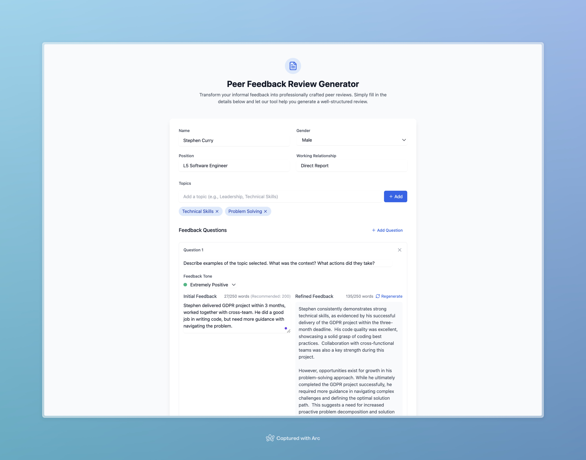

# LLM Peer Review Generator

A tool that leverages Large Language Models (LLMs) to help generate and refine peer feedback reviews for tech companies. This tool helps maintain professionalism, clarity, and constructiveness in peer feedback while preserving the original sentiment and key points.
Powered by [blot.new](https://bolt.new/) and [Gemini LLM](https://gemini.google.com/app).

## Overview

This tool assists in crafting well-structured peer feedback by:
- Reformulating raw feedback into clear, actionable points
- Ensuring professional tone and language
- Support customization of peer name, role, relationship, tone, question etc.


## Installation

1. Clone the repository:
```bash
git clone https://github.com/scoopxx/perf-review-tool
cd perf-review-tool
```

2. Install dependencies:
```bash
npm install
```

3. Create a `.env` file in the root directory:
```env
VITE_GEMINI_API_KEY=your_api_key_here
```

## Running the Application

### Development Mode
```bash
npm run dev
```
The application will be available at `http://localhost:5173`

### Production Build
```bash
npm run build
npm start
```

### Example Screenshot

